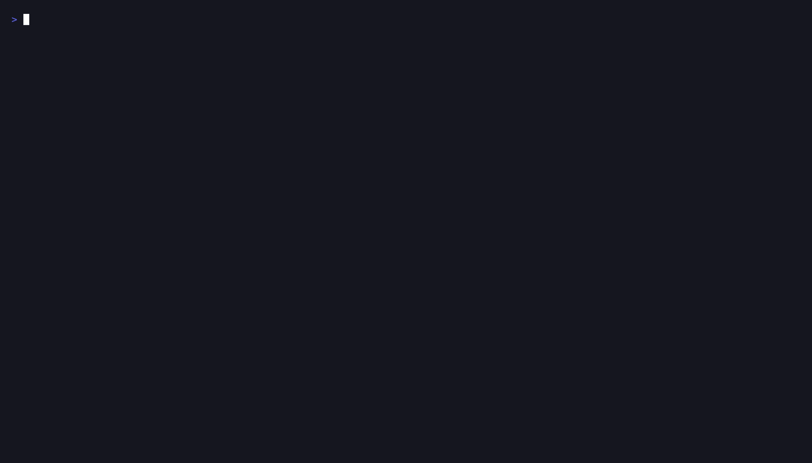

# ⌂ house

A terminal markdown reader and navigator — themable and configurable, with a keyboard-driven modern UI. Point it at a directory and browse its `.md` files without leaving the terminal.



## Features

- **30+ themes** with dark and light tones
- **Responsive layout**
- **Fuzzy search** across nested folders (`.gitignore`-aware)
- **Command palette**
- **Keyboard-driven**
- **Open in browser**
- **Open in `$EDITOR`**

Requires [Bun](https://bun.sh) on `PATH`. Supported on macOS and Linux; Windows is unsupported and unvalidated (see [#129](https://github.com/carlesandres/house/issues/129)).

## Install

```bash
npm install -g @carlesandres/house
# or
bun add -g @carlesandres/house
```

## Upgrade

```bash
npm i -g @carlesandres/house
# or
bun add -g @carlesandres/house
```

## Usage

```
house [options] <path>
```

`<path>` can be a directory (walks for `.md`, `.markdown`, and `.mdx` files) or a single markdown file. Defaults to the current directory if omitted.

### Options

| Flag | Default | Description |
|------|---------|-------------|
| `--theme <name>` | `opencode` | Starting theme (see list below) |
| `--tone dark\|light` | `dark` | Starting tone |
| `--width <N>` | — | Cap rendered markdown width at N columns |
| `--all` | off | Include hidden and gitignored files in discovery |
| `--sort <mode>` | `dirs-first` | Sidebar order: `dirs-first` or `files-first` |
| `--sidebar <mode>` | `auto` | Initial sidebar visibility: `auto`, `on`, or `off` |
| `--serve` | off | Serve the given file as HTML in the browser (skips TUI) |
| `--port <N>` | OS-assigned | Port for `--serve` |
| `--no-mdx` | off | Exclude `.mdx` files from discovery |
| `--no-update-check` | off | Suppress the "newer version available" check (also via `NO_UPDATE_NOTIFIER=1`) |
| `--config-path` | — | Print the resolved config-file path and exit |
| `-h`, `--help` | — | Show help and exit |
| `-v`, `--version` | — | Print version and exit |

## Configuration

house reads optional defaults from a TOML file:

```
$XDG_CONFIG_HOME/house/config.toml   (defaults to ~/.config/house/config.toml)
```

Run `house --config-path` to print the exact location.

```toml
# ~/.config/house/config.toml
theme = "tokyonight"
tone  = "dark"
mdx   = true
```

Supported keys: `theme`, `tone`, `mdx`.

Precedence, highest to lowest:

1. CLI flags (`--theme`, `--tone`, `--no-mdx`)
2. Env vars (`HOUSE_THEME`, `HOUSE_TONE`, `HOUSE_MDX`)
3. Config file
4. Built-in defaults (`opencode` / `dark` / `mdx = true`)

The file is optional — a missing file is fine. Invalid keys, unknown themes, or malformed TOML fail loudly with a one-line error. Per-project config (`.house/config.toml`) and additional keys are deferred.

## Keys

### Global

| Key | Action |
|-----|--------|
| `q` / `ctrl+c` | Quit |
| `tab` | Toggle focus (sidebar ↔ reader) |
| `s` | Toggle sidebar visibility |
| `?` | Show / dismiss help overlay |
| `ctrl+p` | Command palette |
| `o` | Open current file in browser as HTML |
| `e` | Open current file in `$EDITOR` (`$VISUAL` takes precedence) |
| `t` | Next theme |
| `T` | Previous theme |
| `L` | Toggle dark / light tone |

### Sidebar

| Key | Action |
|-----|--------|
| `j` / `↓` | Move selection down |
| `k` / `↑` | Move selection up |
| `J` | Jump down 8 |
| `K` | Jump up 8 |
| `space` / `pagedown` / `ctrl+d` | Page down |
| `b` / `pageup` / `ctrl+u` | Page up |
| `g` | First file |
| `G` | Last file |
| `/` | Filter files (fuzzy match on path) |
| `↵` / `→` / `l` | Open file (focus reader) |

### Reader

| Key | Action |
|-----|--------|
| `esc` / `←` / `h` | Back to sidebar |
| `[` | Previous file |
| `]` | Next file |

## Themes

33 built-in themes, all sourced from the [opencode](https://github.com/anomalyco/opencode) TUI palette:

`aura` · `ayu` · `carbonfox` · `catppuccin` · `catppuccin-frappe` · `catppuccin-macchiato` · `cobalt2` · `cursor` · `dracula` · `everforest` · `flexoki` · `github` · `gruvbox` · `kanagawa` · `lucent-orng` · `material` · `matrix` · `mercury` · `monokai` · `nightowl` · `nord` · `one-dark` · `opencode` · `orng` · `osaka-jade` · `palenight` · `rosepine` · `solarized` · `synthwave84` · `tokyonight` · `vercel` · `vesper` · `zenburn`

Each theme supports dark and light tones. Cycle with `t` / `T`; toggle tone with `L`.

## Inspiration

- [glow](https://github.com/charmbracelet/glow) — render markdown on the CLI, with pizzazz
- [ghui](https://github.com/kitlangton/ghui) — keyboard-driven terminal UI for GitHub pull requests
- [hunk](https://github.com/modem-dev/hunk) — review-first terminal diff viewer for agent-authored changesets
- [opencode](https://github.com/anomalyco/opencode) — terminal UI whose palette inspired house's themes

## License

MIT
