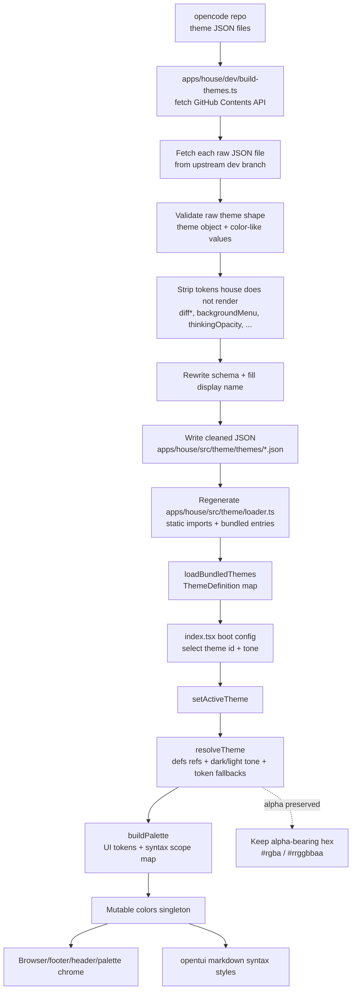

# Theme palette pipeline

Reference map for how house turns upstream opencode theme palettes into the
runtime `colors` object used by UI chrome and markdown syntax styling.

This is intentionally descriptive, not a spec. `apps/house/dev/build-themes.ts`,
`apps/house/src/theme/resolve.ts`, and `apps/house/src/theme/colors.ts` are the source of truth.

## End-to-end flow



## Build-time import from opencode

Run manually with:

```bash
bun run build:themes
```

The script fetches the upstream directory listing from:

```text
https://api.github.com/repos/anomalyco/opencode/contents/packages/opencode/src/cli/cmd/tui/context/theme
```

Then it fetches each raw theme file from:

```text
https://raw.githubusercontent.com/anomalyco/opencode/dev/packages/opencode/src/cli/cmd/tui/context/theme/<name>.json
```

The generated files are committed so normal users and CI do not need network
access. `GITHUB_TOKEN` is optional and only raises the GitHub API rate limit.

## Build-time normalization

`apps/house/dev/build-themes.ts` performs the local adaptation from opencode's full TUI
theme surface to house's smaller markdown-reader surface:

1. Validate that the upstream JSON has a `theme` object.
2. Accept literal hex values, defs references, and `{ dark, light }` values.
3. Preserve the upstream `defs` block when present.
4. Drop tokens that house never renders, such as `diff*` and menu-specific
   tokens.
5. Rewrite `$schema` to house's local schema path.
6. Fill a human-readable `name` from the filename if upstream does not provide
   one.
7. Regenerate `apps/house/src/theme/loader.ts` so bundled themes are static imports.

At this stage, token values should still describe the upstream colours. The
build step should not pre-blend or otherwise reinterpret colour values unless
house deliberately changes the theme contract.

## OpenCode token coverage

OpenCode's TUI theme surface is wider than house's current markdown-reader
surface. The table below maps each upstream colour token to the closest house
palette equivalent.

`ThemeTokens` / `ResolvedTheme` entries are imported from the cleaned JSON and
resolved at runtime. `ColorPalette` direct entries are exposed as top-level
fields on `colors`. Markdown and syntax tokens flow into `colors.syntax` rather
than becoming top-level palette fields.

| OpenCode colour token | House equivalent | Included today? | Notes |
|---|---|---:|---|
| `primary` | `colors.primary` | Yes | Primary accent / selected foreground. |
| `secondary` | `colors.secondary` | Yes | Active contextual metadata. |
| `accent` | `colors.accent` | Yes | Decorative/alternate accent. |
| `error` | `colors.error` | Yes | Error/destructive state. |
| `warning` | `colors.warning` | Yes | Warning/caution state. |
| `success` | `colors.success` | Yes | Success state; rarely used today. |
| `info` | `colors.info` | Yes | Informational state; rarely used today. |
| `text` | `colors.text` | Yes | Default readable UI text. |
| `textMuted` | `colors.textMuted` | Yes | Secondary copy and subdued metadata. |
| `selectedListItemText` | `colors.selectedListItemText` | Yes | Optional upstream token; falls back if omitted. |
| `background` | `colors.background` | Yes | Main active pane background/base canvas. |
| `backgroundPanel` | `colors.backgroundPanel` | Yes | Panel chrome and inactive pane background. |
| `backgroundElement` | `colors.backgroundElement` | Yes | Raised element / active selection background. |
| `backgroundMenu` | — | No | OpenCode menu/popover background. House currently reuses `backgroundElement` / `backgroundPanel` for palette and modal surfaces. Candidate to import if palette/modal surfaces need a distinct menu layer. |
| `border` | `colors.border` | Yes | Default pane/modal border. |
| `borderActive` | `colors.borderActive` | Yes | Focused/active border. |
| `borderSubtle` | `colors.borderSubtle` | Yes | Low-contrast dividers and subdued separators. |
| `diffAdded` | — | No | Diff foreground; no diff renderer in house today. |
| `diffRemoved` | — | No | Diff foreground; no diff renderer in house today. |
| `diffContext` | — | No | Diff context foreground; no diff renderer in house today. |
| `diffHunkHeader` | — | No | Diff hunk/header foreground; no diff renderer in house today. |
| `diffHighlightAdded` | — | No | Strong added-line highlight; no diff renderer in house today. |
| `diffHighlightRemoved` | — | No | Strong removed-line highlight; no diff renderer in house today. |
| `diffAddedBg` | — | No | Added-line background; no diff renderer in house today. |
| `diffRemovedBg` | — | No | Removed-line background; no diff renderer in house today. |
| `diffContextBg` | — | No | Context-line background; no diff renderer in house today. |
| `diffLineNumber` | — | No | Diff line-number foreground; no diff renderer in house today. |
| `diffAddedLineNumberBg` | — | No | Added line-number background; no diff renderer in house today. |
| `diffRemovedLineNumberBg` | — | No | Removed line-number background; no diff renderer in house today. |
| `markdownText` | `colors.syntax.default.fg` | Yes | Resolved token feeds the markdown/default syntax style. |
| `markdownHeading` | `colors.syntax["markup.heading"].fg` | Yes | Shared by heading scopes. |
| `markdownLink` | `colors.syntax["markup.link"].fg` | Yes | Link URL/underline colour. |
| `markdownLinkText` | `colors.syntax["markup.link.label"].fg` | Yes | Link label colour. |
| `markdownCode` | `colors.syntax["markup.raw.inline"].fg` | Yes | Inline code foreground. |
| `markdownBlockQuote` | `colors.syntax["markup.quote"].fg` | Yes | Blockquote foreground. |
| `markdownEmph` | `colors.syntax["markup.italic"].fg` | Yes | Emphasis foreground. |
| `markdownStrong` | `colors.syntax["markup.strong"].fg` | Yes | Strong/bold foreground. |
| `markdownHorizontalRule` | — | Yes | Imported/resolved, but currently not mapped by `buildSyntaxMap()`. Candidate for a horizontal-rule style if opentui exposes a stable scope. |
| `markdownListItem` | `colors.syntax["markup.list"].fg` | Yes | List bullet/list marker foreground. |
| `markdownListEnumeration` | — | Yes | Imported/resolved, but currently not mapped by `buildSyntaxMap()`. Candidate if ordered-list enumeration scopes are available. |
| `markdownImage` | — | Yes | Imported/resolved, but currently not mapped by `buildSyntaxMap()`. Candidate if image marker scopes are available. |
| `markdownImageText` | — | Yes | Imported/resolved, but currently not mapped by `buildSyntaxMap()`. Candidate if image alt-text scopes are available. |
| `markdownCodeBlock` | `colors.syntax["markup.raw.block"].fg` | Yes | Fenced/block code foreground. |
| `syntaxComment` | `colors.syntax.comment.fg` | Yes | Comment foreground. |
| `syntaxKeyword` | `colors.syntax.keyword.fg` | Yes | Keyword foreground. |
| `syntaxFunction` | `colors.syntax.function.fg` | Yes | Function/property foreground. |
| `syntaxVariable` | `colors.syntax.variable.fg` | Yes | Variable foreground. |
| `syntaxString` | `colors.syntax.string.fg` | Yes | String foreground. |
| `syntaxNumber` | `colors.syntax.number.fg` | Yes | Number foreground. |
| `syntaxType` | `colors.syntax.type.fg` | Yes | Type foreground. |
| `syntaxOperator` | `colors.syntax.operator.fg` | Yes | Operator foreground. |
| `syntaxPunctuation` | `colors.syntax["punctuation.bracket"].fg` | Yes | Punctuation foreground. |

OpenCode also has `thinkingOpacity`, but it is a numeric opacity control rather
than a colour token. House does not currently import it.

## Runtime resolution

At runtime, `apps/house/src/theme/loader.ts` imports every bundled JSON file and exposes a
`ThemeDefinition` map. Boot config selects a theme id and tone, then
`setActiveTheme(definition, tone)` updates the stable `colors` singleton.

`resolveTheme()` flattens a `ThemeJson` into `ResolvedTheme`:

- applies the selected tone for `{ dark, light }` values;
- resolves string references through the theme's `defs` map;
- fills omitted tokens through `TOKEN_FALLBACK` or hard-coded safe defaults;
- normalizes hex spelling before the palette is consumed.

`buildPalette()` then maps the resolved tokens into:

- direct UI chrome tokens (`background`, `textMuted`, `border`, `primary`, ...);
- an opentui tree-sitter syntax style map derived from markdown and syntax
  tokens.

Components import and read `colors` directly. Theme changes mutate that object
in place so the reference remains stable without a React context.

## Alpha preservation (#189)

Some opencode themes encode muted/border contrast as transparency, for example
Cursor's:

```text
#e4e4e45e
#141414ad
#e4e4e413
#e4e4e426
```

`resolveTheme()` normalizes hex spelling without dropping alpha:

| Input | Output |
|---|---|
| `#rgb` (3) | `#rrggbb` |
| `#rgba` (4) | `#rrggbbaa` |
| `#rrggbb` (6) | `#rrggbb` (lowercase) |
| `#rrggbbaa` (8) | `#rrggbbaa` (lowercase) |

A cleaned upstream palette that contains `#rrggbbaa` still carries that alpha
when `colors` and the syntax style map receive it. OpenTUI parses both 6- and
8-digit hex via `RGBA.fromHex` / `parseColor`.
